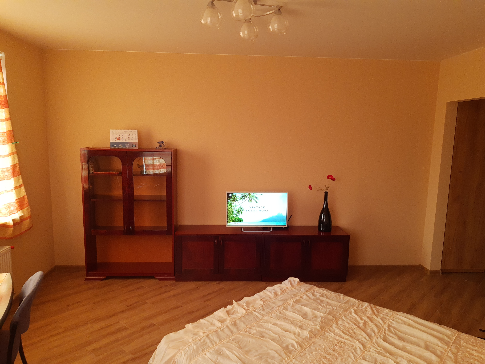
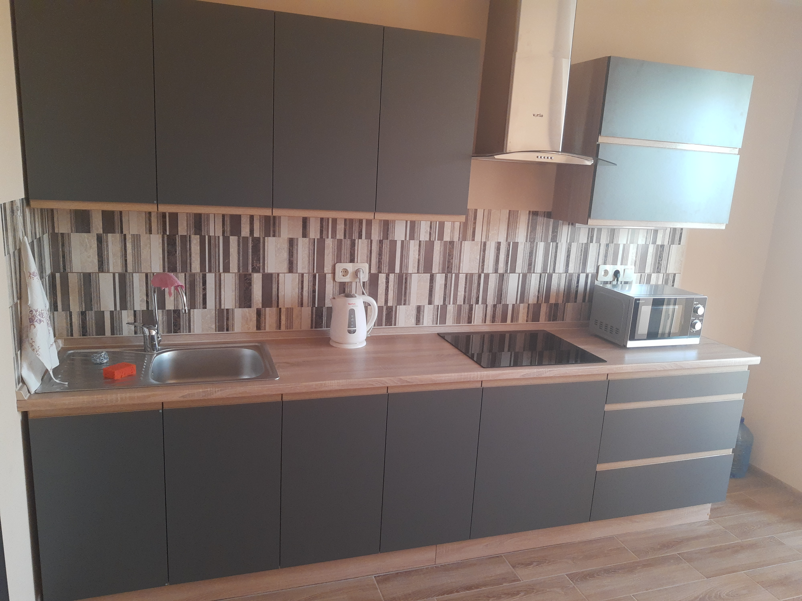
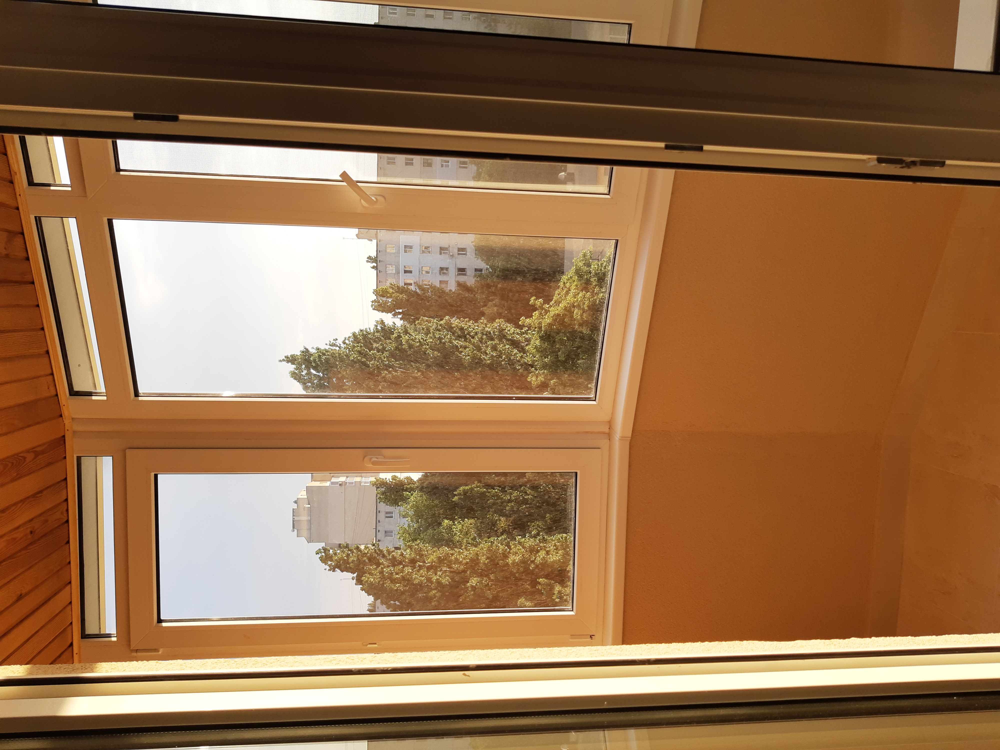

## _Здравствуйте! Меня зовут Максим._

Сдам свою 1-комнатную уютную квартиру в Одессе на ул. Среднефонтанской 30/1, внутри квартала, тихий двор. Первая сдача, свежий ремонт, 8/14 эт. 44 кв. метра. Кухня + комната, застекленный балкон. Дизайнерский дорогой ремонт, мебель, техника, душевая кабина, 2х спальная кровать, 2 шкафа. Гостевая стоянка. Интернет Wi-Fi. Дом очень теплый, своя котельная, есть теплосчетчик. Хорошая транспортная развязка, в пешей доступности Вокзал, Привоз, 5 ВУЗов, супермаркеты, бювет, парк, детская площадка, спортплощадка, детский садик, школа. Цена на период военного положения 8000 грн. + коммунальные. Контактный телефон +38о639577521

## _Hello! My name is Max._

I am renting my 1-room cozy apartment in Odessa on the street Srednefontanskaya 30/1, inside the quarter, a quiet courtyard. First rent, fresh renovation, 8/14 fl. 44 sq. meters. Kitchen + room, balcony. Designer expensive renovation, furniture, appliances, shower, double bed, 2 wardrobes. Guest parking. Internet WiFi. The House Is Very Warm, Has Its Own Boiler Room, There Is A Heat Meter. Good Transport Interchange, Within Walking Distance Of The Station, Privoz, 5 Universities, Supermarkets, Water station, Park, Playground, Sports Ground, Kindergarten, School. The price for the period of martial law is 8000 UAH / month + utilities. Mob. tel.: +38о639577521

