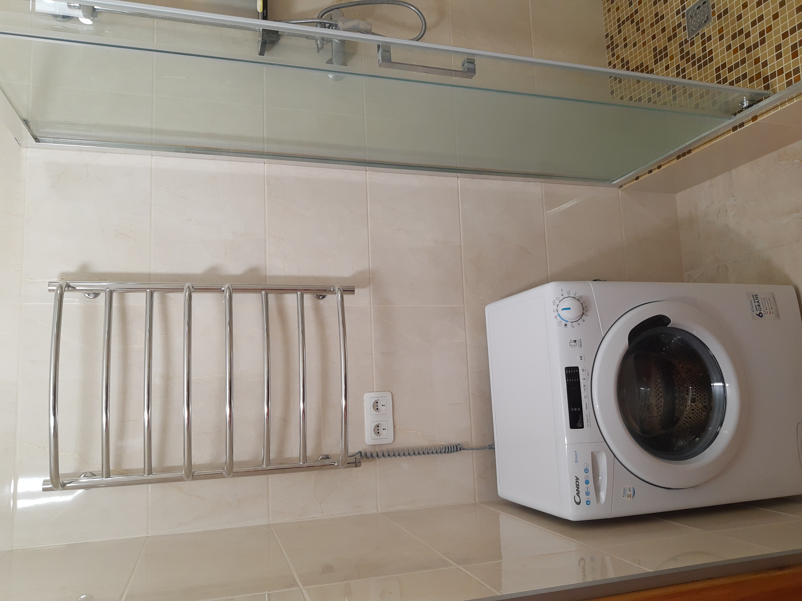
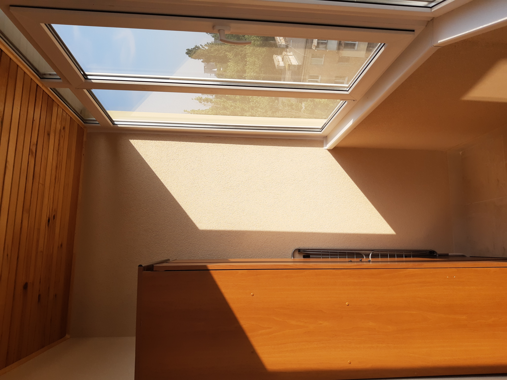
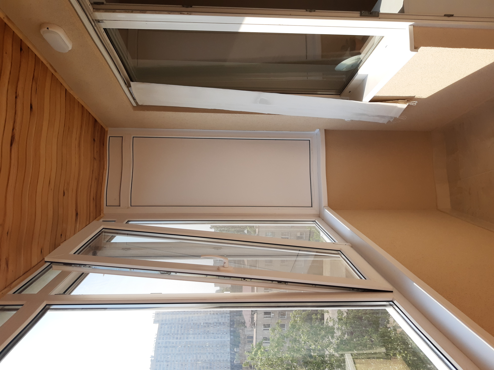

# _Apartment for rent in Odessa_

Cozy 1-room apartment for rent in Odessa
I am renting out my bright and spacious apartment at 30/1 Srednefontanskaya Street, located inside a quiet and green courtyard.
Fresh designer renovation, 8th floor of a 14-story building, total area 44 sq.m. Layout: open-plan kitchen + living room, hallway, glazed balcony.
Fully furnished and equipped with everything you need for comfortable living: modern furniture, household appliances, shower cabin, double bed, 2 large wardrobes, air conditioner, TV, washing machine.
High-speed Wi-Fi internet. Guest parking available in the yard.
The house is very warm, with its own boiler room and a heat meter.
Great location: excellent transport connections, within walking distance to the Railway Station, Privoz Market, several universities, supermarkets, water station, park, playground, sports ground, kindergarten, and school.

# _Здам квартиру в Одесі_
Здам 1-кімнатну затишну квартиру в Одесі
Пропоную в оренду свою світлу та простору квартиру за адресою вул. Середньофонтанська, 30/1 — у середині кварталу, в тихому та зеленому подвір’ї.
Свіжий дизайнерський ремонт, 8 поверх 14-поверхового будинку, площа 44 м². Планування: кухня-студія + кімната, передпокій, засклений балкон.
Квартира повністю укомплектована: сучасні меблі, побутова техніка, душова кабіна, двоспальне ліжко, 2 великі шафи, кондиціонер, телевізор, пральна машина.
Інтернет Wi-Fi. Гостьова стоянка у дворі.
Будинок дуже теплий, має власну котельню та теплолічильник.
Інфраструктура: зручна транспортна розв’язка, у пішій доступності Залізничний вокзал, Привоз, університети, супермаркети, бювет, парк, дитячий майданчик, спортмайданчик, дитячий садок і школа.

# _Сдам квартиру в Одессе_

Сдам 1-комнатную уютную квартиру в Одессе
Сдаётся моя светлая и просторная квартира на ул. Среднефонтанской, 30/1 — внутри квартала, в тихом и зелёном дворе.
Свежий дизайнерский ремонт, 8 этаж 14-этажного дома, площадь 44 м². Планировка: кухня-студия + комната, прихожая, застеклённый балкон.
В квартире есть всё необходимое для комфортного проживания: современная мебель, бытовая техника, душевая кабина, двуспальная кровать, 2 больших шкафа, кондиционер, телевизор, стиральная машина.
Интернет Wi-Fi. Гостевая парковка во дворе.
Дом очень тёплый, с собственной котельной и теплосчётчиком.
Инфраструктура: отличная транспортная развязка, в пешей доступности ЖД вокзал, Привоз, университеты, супермаркеты, бювет, парк, детская площадка, спортплощадка, детсад и школа.

